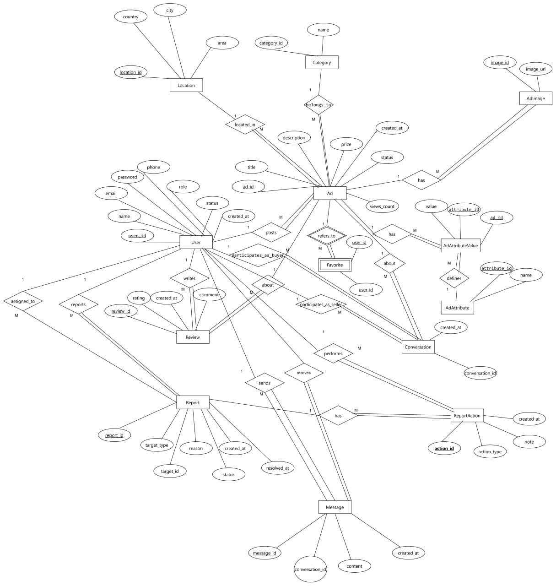
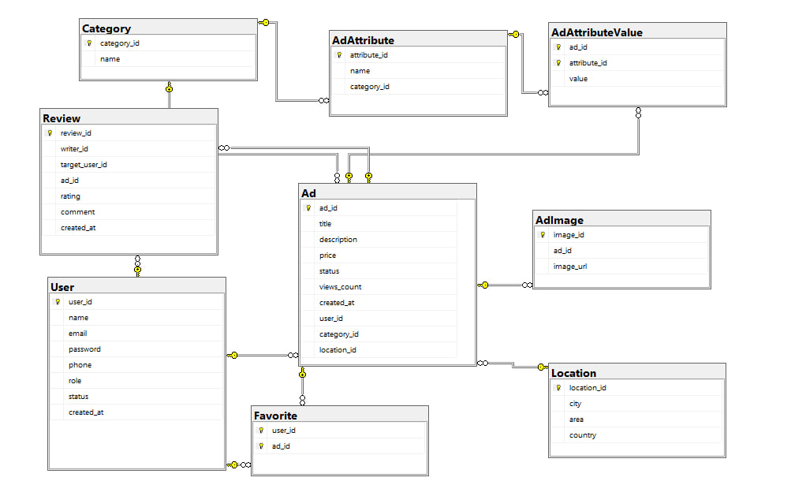
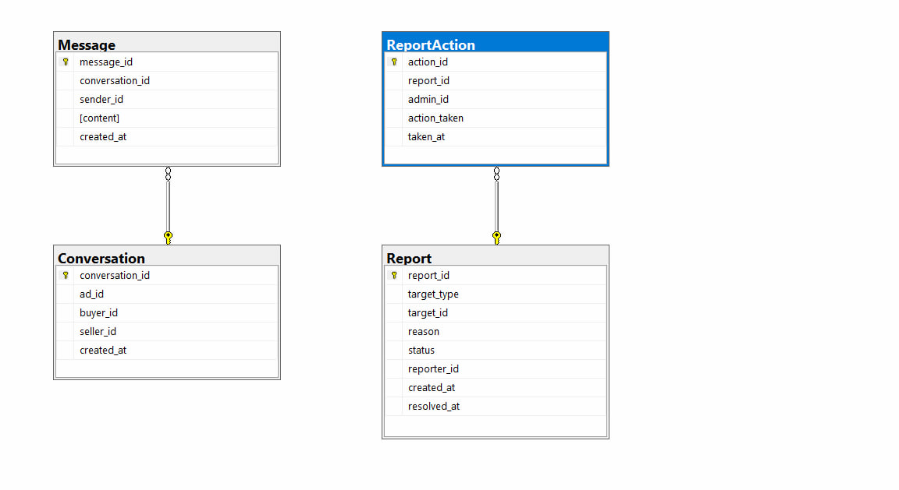

# Distributed Classified Ads System

> A university project for the **Distributed Databases** course — modeling a classified ads platform (similar to Dubizzle/OLX) using a distributed database architecture across multiple servers.

---

## Table of Contents

- [Project Overview](#project-overview)
- [System Architecture](#system-architecture)
- [Entity-Relationship Diagram](#entity-relationship-diagram)
- [SQL Implementation](#sql-implementation)
- [Repository Structure](#repository-structure)
- [Team](#team)

---

## Project Overview

This project simulates a real-world **classified ads marketplace** — where users can post, browse, and manage ads for items and services — built on top of a **distributed relational database** system.

The system supports:
-  User roles: regular users, moderators, and admins
-  Ad listings with images, attributes, categories, and locations
-  Buyer–seller messaging through conversations
-  User-to-user reviews linked to ad transactions
-  Content reporting and moderation workflows
-  Favorites / saved ads

---

## System Architecture

The database is distributed across **two physical servers**, each responsible for a logically cohesive subset of the data:

| Server | Responsibility |
|--------|---------------|
| **Server 1** | Core marketplace data — ads, categories, locations, attributes, reviews, favorites |
| **Server 2** | Communication & moderation data — messages, conversations, reports, report actions |

This separation follows the principle of **functional fragmentation**: read-heavy, public-facing data (ads, browsing) is isolated from operational/transactional data (messaging, moderation), allowing each server to be independently scaled and optimized.

```
┌─────────────────────────────────┐     ┌─────────────────────────────────┐
│           SERVER 1              │     │           SERVER 2              │
│  ─────────────────────────────  │     │  ─────────────────────────────  │
│  Location    Category           │     │  Conversation  Message          │
│  Ad          AdImage            │     │  Report        ReportAction     │
│  AdAttribute AdAttributeValue   │     │                                 │
│  Review      Favorite           │     │                                 │
│  [User — shared reference]      │     │  [User — shared reference]      │
└─────────────────────────────────┘     └─────────────────────────────────┘
```

> **Note:** The `User` table is referenced by both servers. In the distributed design, it acts as a global relation accessible from both nodes.

---

## Entity-Relationship Diagram



---

## Schema Diagrams

**Server 1 Schema**



**Server 2 Schema**



---

## SQL Implementation

The SQL scripts are written for **Microsoft SQL Server (T-SQL)**.

| File | Contents |
|------|----------|
| [`sql/server1_userui.sql`](sql/server1_userui.sql) | DDL for Server 1: Location, Category, User, Ad, AdImage, AdAttribute, AdAttributeValue, Review, Favorite |
| [`sql/server2_operations.sql`](sql/server2_operations.sql) | DDL for Server 2: Conversation, Message, Report, ReportAction |

---

## Repository Structure

```
Distributed-DB-Classified-Ads/
│
├── README.md
│
├── docs/
│   ├── ERD.jpg
│   ├── Schema1.jpg
│   ├── Schema2.jpg
│   └── DDB_Presentation.pdf
│
├── schema/
│   ├── entities_and_attributes.md
│   └── fragmentation_design.md
│
└── sql/
    ├── server1_userui.sql
    └── server2_operations.sql
```

---

## Team

> *University project — Distributed Databases course*

| # | Name |
|---|------|
| 1 | Nouran Ehab Abdallah |
| 2 | Basmala Salah Nasr |
| 3 | Aya Hussein Mohamed |
| 4 | Shahd Mohamed Gallal |
| 5 | Marwa Abdel Nabi |
---
